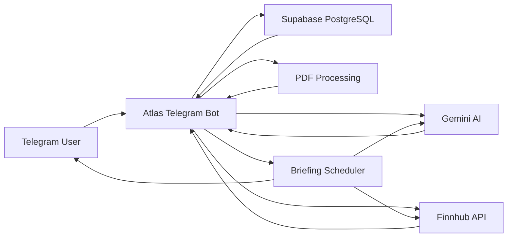

# Atlas Financial Assistant

Atlas is an AI-powered financial assistant that lives inside Telegram. It helps finance professionals monitor companies, research market developments, analyze financial documents, and receive personalized financial intelligence through natural conversations.

Atlas is designed to feel like an experienced financial analyst rather than a command-based chatbot.

## Features

- Natural Telegram conversations
- Personalized conversational onboarding
- Persistent conversation memory
- Live stock prices and daily price movements
- Company-news retrieval and relevance filtering
- Concise explanations of why financial developments matter
- PDF financial-report summaries
- Follow-up questions with document page references
- Voice-message transcription and processing
- Financial chart, table, and image analysis
- Personalized company watchlists
- Scheduled daily financial briefings
- Multi-user briefing schedules and preferences
- Graceful handling of API limits and unavailable information

## Example Conversations

Users can communicate naturally without remembering commands:

- “Track Nvidia, AMD, and Microsoft.”
- “What is my watchlist?”
- “What is Nvidia’s current stock price?”
- “What important Nvidia news should I know about?”
- “Send my daily briefing at 8:00 AM.”
- “What do you remember about my research focus?”
- “What are the biggest risks in this annual report?”
- “Explain the employee benefit liability and cite the page.”
- “What changed the most in this financial chart?”

Users can also send voice messages, financial images, charts, and PDF reports.

## Architecture



## Technology Stack

- Python — backend and workflow orchestration
- aiogram — Telegram bot integration
- Gemini API — conversations, transcription, document analysis, and image analysis
- Finnhub API — stock quotes and company news
- Supabase PostgreSQL — users, conversations, watchlists, and briefing preferences
- psycopg — PostgreSQL database connectivity
- pypdf — PDF text extraction
- python-dotenv — environment-variable management
- asyncio — background scheduling and non-blocking operations
- Git and GitHub — version control and source-code backup

## Project Structure

```text
atlas-financial-assistant/
├── bot.py
├── database.py
├── financial_data.py
├── document_data.py
├── requirements.txt
├── test_database.py
├── test_gemini.py
├── .gitignore
└── README.md
```

### Main Components

- `bot.py` contains Telegram handlers, AI workflows, media processing, personalization, and the briefing scheduler.
- `database.py` manages users, messages, watchlists, and briefing preferences.
- `financial_data.py` retrieves stock quotes and company news from Finnhub.
- `document_data.py` extracts readable text from uploaded PDF files.
- `requirements.txt` contains the required Python packages.

## Database Structure

Atlas uses the following PostgreSQL tables:

- `users` — Telegram identity and profile information
- `messages` — persistent conversation history
- `watchlist` — companies monitored by each user
- `briefing_preferences` — briefing status, time, timezone, and last delivery date

## Installation

### 1. Clone the repository

```powershell
git clone https://github.com/YOUR_USERNAME/atlas-financial-assistant.git
Set-Location "atlas-financial-assistant"
```

Replace `YOUR_USERNAME` with your GitHub username.

### 2. Create a virtual environment

```powershell
python -m venv .venv
```

### 3. Activate the environment on Windows

```powershell
.\.venv\Scripts\Activate.ps1
```

If PowerShell blocks script execution:

```powershell
Set-ExecutionPolicy -Scope CurrentUser RemoteSigned
```

Then activate the environment again.

### 4. Install dependencies

```powershell
python -m pip install -r requirements.txt
```

## Environment Variables

Create a `.env` file in the project root:

```env
TELEGRAM_BOT_TOKEN=
GEMINI_API_KEY=
GEMINI_MODEL=gemini-3.5-flash-lite
FINNHUB_API_KEY=
DATABASE_URL=
```

Required services:

- Telegram BotFather for the Telegram bot token
- Google AI Studio for a Gemini API key
- Finnhub for financial-market data
- Supabase for PostgreSQL storage

Never commit `.env`. It contains private credentials.

## Running Atlas

Start the bot:

```powershell
python bot.py
```

The terminal should display a message indicating that Atlas is polling Telegram.

Keep the terminal running while using the bot. Stop it with:

```text
Ctrl+C
```

## Product Experience

### Onboarding

Atlas begins with a short natural conversation to understand the user’s role, sectors, companies, and research preferences.

### Market Intelligence

Atlas retrieves verified stock-price information from Finnhub and displays the quote timestamp and source.

### Company News

Atlas filters company news for relevance, selects decision-relevant developments, attributes claims, and explains why they may matter.

### Document Intelligence

Users can upload PDF financial reports. Atlas extracts the text, creates an executive summary, and answers follow-up questions with page references.

### Voice Messages

Atlas transcribes Telegram voice messages and routes the resulting request through the appropriate price, news, document, or conversational workflow.

### Image Intelligence

Users can upload financial charts, tables, slides, and screenshots. Atlas extracts readable figures, identifies trends, and communicates uncertainty when information is unclear.

### Daily Briefings

Users can naturally create a watchlist and select a briefing time. Atlas checks each user’s schedule and sends a personalized briefing when material developments exist.

## Reliability Principles

- Never invent stock prices, financial figures, dates, news, or sources.
- Retrieve live information when local knowledge is insufficient.
- Clearly attribute third-party news claims.
- Do not imply that third-party coverage is independently verified.
- Report price movements and news separately.
- Do not claim that news caused a price movement without supporting evidence.
- Communicate uncertainty when information cannot be read or verified.
- Remain silent when no material daily update exists.
- Keep Telegram responses concise and immediately useful.

## Security

- Credentials are stored in `.env`.
- `.env` and `.venv` are excluded through `.gitignore`.
- Database connections require SSL.
- User-specific data is separated using Telegram user IDs.
- API keys and database passwords are never included in source code.

## Prototype Limitations

- PDF text is retained in memory only while the bot process is running.
- Scanned PDFs without readable text may require OCR support.
- The company-to-ticker mapping currently covers selected demonstration companies.
- Free API tiers have request and rate limits.
- Daily briefings require the bot process to remain running.
- The prototype is not designed for production trading or order execution.

## Future Improvements

- Persistent financial-document storage
- SEC EDGAR filing integration
- Earnings calendars and filing alerts
- Portfolio monitoring
- Configurable materiality thresholds
- Email and calendar integrations
- Improved source-ranking and duplicate-news detection
- Cloud deployment with continuous availability

## Disclaimer

Atlas provides financial research assistance and informational summaries. It does not provide personalized investment advice, execute trades, or guarantee the accuracy of third-party information.

## Author

Developed as an AI Financial Assistant prototype for a finance-focused product and engineering challenge.