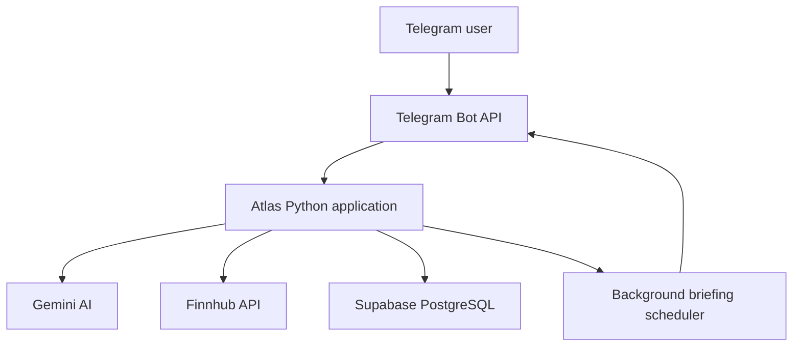

# Atlas Financial Assistant

Atlas is an AI-powered financial assistant that lives inside Telegram. It helps finance professionals monitor companies, retrieve financial information, analyze reports, remember research preferences, and receive proactive daily intelligence through natural conversations.

## Live Demo

* Telegram bot: [@atlas_finance_demo_bot](https://t.me/atlas_finance_demo_bot)
* Demo video: - Demo video: [Watch the Atlas demonstration](https://drive.google.com/file/d/1V1ZiSPMOGY94GoazJ5JMCe4g3-Wgk9fo/view?usp=sharing)

## Product Overview

Finance professionals frequently switch between market-data platforms, news websites, reports, spreadsheets, and productivity tools. Atlas brings the most important parts of that workflow into one conversational Telegram experience.

Atlas is designed to feel like an experienced financial analyst rather than a command-based chatbot. Users can communicate using text, voice messages, images, and financial documents without navigating menus or remembering commands.

The assistant prioritizes concise and decision-relevant insights. It explains why information matters and remains silent when a proactive update does not contain anything material.

## Core Features

### Natural Financial Conversations

Users can ask financial questions naturally without slash commands, menus, or predefined prompts.

Examples:

* What is Nvidia’s current stock price?
* What important Nvidia news should I know about?
* Compare Nvidia and AMD from a semiconductor analyst’s perspective.
* What do you remember about my research focus?

### Live Financial Information

Atlas uses Finnhub to retrieve verified market information, including:

* Stock prices
* Daily price changes
* Session ranges
* Previous closing prices
* Company-specific financial news
* Source and quote timestamps

Atlas does not invent live financial figures when verified information is unavailable.

### Persistent Personalization

Atlas stores user information and conversation context in Supabase PostgreSQL.

It can remember:

* Research focus
* Companies and sectors of interest
* Conversation history
* Watchlist companies
* Briefing schedule
* User timezone
* Previous briefing delivery

Each Telegram user receives separate preferences and memory.

### Financial News Intelligence

Atlas retrieves relevant company news and uses AI to identify the most decision-relevant developments.

Instead of simply forwarding headlines, it explains:

* What happened
* Why it matters
* Which company or industry exposure may be affected
* The source and publication time

### Financial Document Intelligence

Users can upload PDF financial reports directly in Telegram.

Atlas can:

* Produce concise executive summaries
* Identify major financial risks
* Extract important figures
* Explain financial performance
* Answer follow-up questions
* Cite relevant document pages

The uploaded document remains available for follow-up analysis during the active application session.

### Image and Chart Analysis

Users can upload financial charts, tables, presentations, or screenshots.

Atlas extracts the visible information and explains:

* Important changes
* Unusual trends
* Margin movements
* Revenue and profitability divergence
* Decision-relevant implications

### Voice Messages

Users can send Telegram voice messages instead of typing.

Atlas transcribes the message and routes the request through the same conversational and financial-data workflows used for text requests.

### Watchlists and Proactive Briefings

Users can naturally create and update their watchlists.

Examples:

* Track Nvidia, AMD, and Microsoft.
* Stop tracking Microsoft.
* What is my watchlist?
* Send my daily briefing at 8:00 AM India time.

Atlas schedules personalized briefings using each user’s watchlist and preferred time. The briefing combines relevant market performance and company news.

If no material development is found, Atlas remains silent to avoid unnecessary notifications.

## Architecture



## Technology Stack

| Component                    | Technology                      |
| ---------------------------- | ------------------------------- |
| Primary interface            | Telegram                        |
| Bot framework                | aiogram                         |
| Backend language             | Python                          |
| AI and multimodal processing | Google Gemini                   |
| Financial market data        | Finnhub                         |
| Database                     | Supabase PostgreSQL             |
| Database driver              | psycopg                         |
| PDF processing               | Python PDF-processing libraries |
| Background jobs              | Asynchronous Python scheduler   |
| Cloud deployment             | Google Cloud Compute Engine     |
| Process management           | systemd                         |
| Operating system             | Debian GNU/Linux 12             |
| Version control              | Git and GitHub                  |

## Project Structure

```text
financial-assistant/
├── bot.py
├── database.py
├── document_data.py
├── financial_data.py
├── requirements.txt
├── .env.example
├── .gitignore
├── test_database.py
├── test_gemini.py
└── README.md
```

### Main Modules

* `bot.py` manages Telegram conversations, AI generation, multimodal messages, and scheduled briefings.
* `database.py` manages users, messages, watchlists, briefing preferences, and persistent memory.
* `financial_data.py` retrieves and formats stock quotes and company news.
* `document_data.py` extracts and prepares PDF content for financial analysis.

## Local Setup

### Prerequisites

* Python 3.11 or newer
* Git
* Telegram bot token
* Gemini API key
* Finnhub API key
* Supabase PostgreSQL database

### 1. Clone the repository

```bash
git clone YOUR_GITHUB_REPOSITORY_URL
cd atlas-financial-assistant
```

### 2. Create a virtual environment

Windows PowerShell:

```powershell
python -m venv .venv
.venv\Scripts\Activate.ps1
```

Linux or macOS:

```bash
python3 -m venv .venv
source .venv/bin/activate
```

### 3. Install dependencies

```bash
python -m pip install --upgrade pip
pip install -r requirements.txt
```

### 4. Configure environment variables

Create a `.env` file in the project root:

```env
TELEGRAM_BOT_TOKEN=your_telegram_bot_token
GEMINI_API_KEY=your_gemini_api_key
GEMINI_MODEL=your_supported_gemini_model
FINNHUB_API_KEY=your_finnhub_api_key
DATABASE_URL=your_supabase_postgresql_connection_string
```

Never commit the `.env` file or expose its contents.

### 5. Start Atlas

```bash
python bot.py
```

Open Telegram and begin a conversation with the bot.

## Google Cloud Deployment

Atlas is deployed continuously on Google Cloud Compute Engine using:

* E2 `e2-micro` virtual machine
* `us-central1` region
* Debian GNU/Linux 12
* 10 GB standard persistent disk
* Python virtual environment
* Telegram long polling
* A protected server-side `.env` file
* A `systemd` background service

The service automatically starts when the VM boots and restarts Atlas if the process exits unexpectedly.

Because Atlas uses Telegram long polling, it does not require an exposed web application port or an HTTP webhook.

Example service-management commands:

```bash
sudo systemctl status atlas-bot
sudo systemctl restart atlas-bot
sudo journalctl -u atlas-bot -n 50 --no-pager
```

The cloud VM should be the only active polling instance. Running the same Telegram token locally and in the cloud simultaneously may cause polling conflicts.

## Example Judge Workflows

### Memory

```text
I am an equity research analyst covering semiconductor companies.
```

```text
I focus mostly on Nvidia.
```

```text
What do you remember about my research focus?
```

### Live Market Data

```text
What is Nvidia's current stock price?
```

### Financial News

```text
What important Nvidia news should I know about?
```

### Company Comparison

```text
Compare Nvidia and AMD from the perspective of a semiconductor analyst.
```

### Document Analysis

Upload a financial PDF and ask:

```text
Identify the three biggest financial risks and cite the relevant pages.
```

### Chart Analysis

Upload a financial chart and ask:

```text
What changed the most, and why does it matter?
```

### Watchlist and Briefing

```text
Track Nvidia, AMD, and Microsoft.
```

```text
Send my daily briefing at 8:00 AM India time.
```

## Product Design Principles

Atlas follows these principles:

* Every interaction should reduce manual financial research.
* Responses should be concise and immediately useful.
* Verified financial data should be preferred over model memory.
* Important developments should include an explanation of why they matter.
* The experience should remain conversational rather than command-driven.
* Proactive intelligence should prioritize quality over frequency.
* The assistant should communicate uncertainty instead of inventing information.

## Security

* Secrets are stored in environment variables.
* `.env` and virtual-environment files are excluded from Git.
* Database connections use encrypted transport.
* Telegram users have separate memory and preferences.
* API keys, database credentials, VM addresses, and cloud project identifiers are not included in this repository.
* The cloud `.env` file is restricted using operating-system file permissions.

## Current Prototype Limitations

* Financial-data availability depends on Finnhub coverage and rate limits.
* AI responses depend on Gemini availability and quota limits.
* Uploaded PDF context is held in application memory and is cleared after a service restart.
* Daily briefings depend on available market data and may remain silent when no material update is detected.
* Gmail, Google Calendar, Google Drive, and Google Sheets integrations are not included in this prototype.
* Atlas provides research assistance and does not execute trades.

## Disclaimer

Atlas is a demonstration project for financial research and productivity. Its responses are for informational purposes only and should not be treated as investment, legal, accounting, or trading advice. Users should verify material financial information through primary sources before making decisions.
